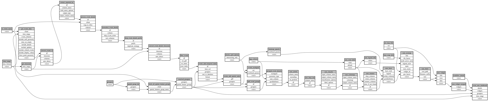

```
# AUTOGENERATED BY ECOSCOPE-WORKFLOWS; see fingerprint in README.md for details

```

```yaml
# fingerprint:
artifacts_sha256_basic: 2b6ed59fcff27eaff2aa4436b37428056c91aa34d15770d2f61c18d9750adbea
artifacts_sha256_strict: d9196cb6545566921629705d003943db887d46a5af86b69284bd8a3d4a9f365e
installed_requirements:
- channel: https://repo.prefix.dev/ecoscope-workflows/
  name: ecoscope-platform
  version: {version: ==2.19.0}
- channel: conda-forge
  name: pydeck
  version: {version: ==0.9.2}
params_sha256: 674c6a20da1d08c2b5aad6c180f0d23505fbb39afeaba921a2a500cc1f5ea5ec
spec_sha256: 9883ba12bb8858fd5727d39515662d80e8d07d2f6fd6c7c8125ddea3044a41b8

```

# ecoscope-workflows-event-sum-map-workflow


