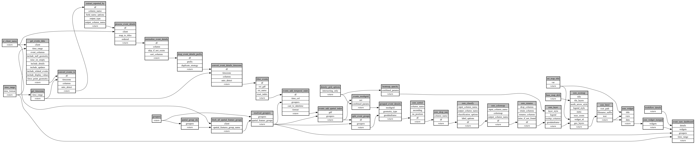

```
# AUTOGENERATED BY ECOSCOPE-WORKFLOWS; see fingerprint in README.md for details

```

```yaml
# fingerprint:
artifacts_sha256_basic: bda01815b2d78c267cbe32bb53b07777f2a404c655d1f234f0213ebbad3b304b
artifacts_sha256_strict: 8c7f8a15d0df5af5cf49cb8a4e595f0fd02f5e4f02fc2e7c354dc4e071b45fb0
installed_requirements:
- channel: https://repo.prefix.dev/ecoscope-workflows/
  name: lonboard
  version: {version: ==0.0.8}
- channel: conda-forge
  name: numpy
  version: {version: ==2.0.2}
- channel: conda-forge
  name: pyarrow
  version: {version: ==23.0.1}
- channel: conda-forge
  name: rasterio
  version: {version: ==1.4.4}
- channel: conda-forge
  name: pydeck
  version: {version: ==0.9.2}
params_sha256: 08d49f6a4a68c639b388957fb199cfaf95e0e1ee2fa125e597f45193a8135749
spec_sha256: a92cb2cb77a97cb66919b7d71f73b1e21d988d8629bf2212c34a536d6724307b

```

# ecoscope-workflows-patrol-event-sum-map-workflow


